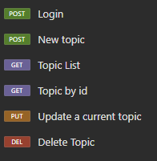

# Forum API

## Functionality
This is a program to manage a topic section in a forum with a local API in a Database

 

## Technologies
* Java (version 17)
* Maven (version 4)
* Insomnia (version 9.3.2)

___

    
Spring Boot (version 3.3.0) Dependencies:

* Lombok
* Spring Web
* Spring Boot DevTools
* Spring Data JPA
* Flyway Migration
* MySQL Driver
* Validation
* Spring Security

## Database Scheeme

## Author

[Alberto Luque](https://www.linkedin.com/in/alberto-luque-fve/)
